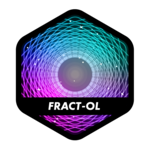
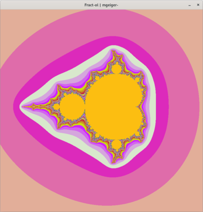
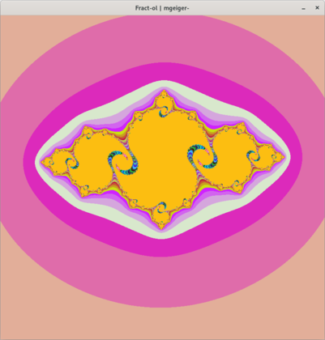
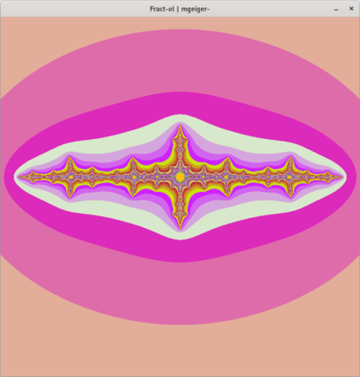

<p align="center">
    
</p>

<h1 align="center">
   fract-ol
</h1>

<p align="center">
    
    
</p>

## Description
`Fractol` is a graphical project at 42 that involves exploring and rendering various fractals. The program allows users to interactively navigate and zoom into fractal sets, providing a visually captivating experience.

## Features
- Renders multiple types of fractals, including the Mandelbrot set, Julia set, and others.
- Supports real-time zooming and panning to explore fractals in detail.
- User-friendly controls and interactive features.

## Supported Fractals
- Mandelbrot Set
- Julia Set

## Controls
- Arrow keys: Move the fractal.
- Scroll wheel: Zoom in/out.
- Mouse click: Change the Julia set parameter (if applicable).
- Key `P`: Increases iterations.
- Key `O`: Reduces iterations.

## Usage
### Compilation
To compile the `./fractol` program, you can use the provided Makefile. Simply run:

```bash
make
```

This will generate the fractol executable.

### Execution

To use Fractol, run the executable with the name of the fractal you want to explore:

```bash
./fractol julia
```

### Screenshots

### Mandelbrot Set


### Julia Set


### Julia can also accept custom parameters

